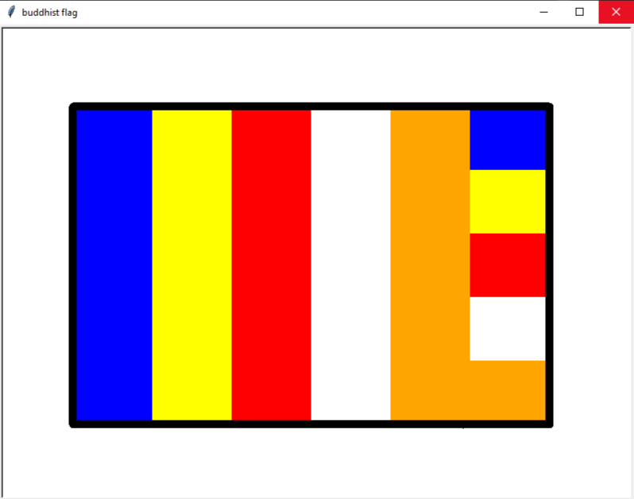

# 
Buddhist Flag

This repository provides Python code for generating the Buddhist flag using the turtle graphics library. It offers a visual representation of this sacred symbol, promoting cultural appreciation and artistic exploration.

 

